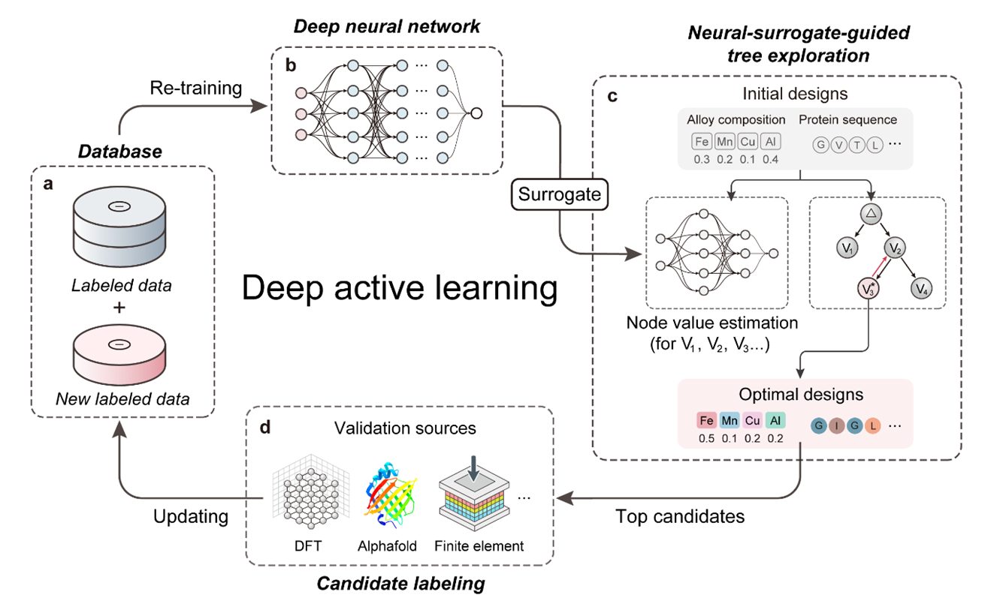
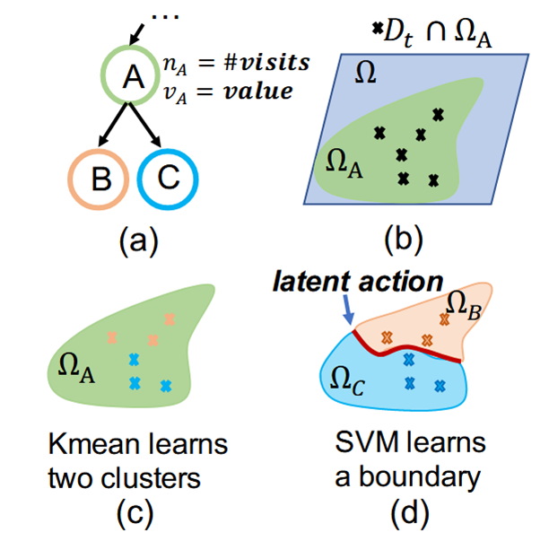

# 黑箱函数优化项目：DANTE与LA-MCTS算法实现

## 项目简介

本项目分别实现了两种黑箱函数优化算法：**DANTE**（Deep Active Learning with Neural-Surrogate-Guided Tree Exploration）和**LA-MCTS**（Learning Search Space Partition for Black-box Optimization using Monte Carlo Tree Search），并基于20D Rosenbrock以及20D Schwefel函数数据集进行优化，限制为一共三轮迭代，每次迭代只向目标函数提交20个样本进行真值计算。对比两种算法在高维黑箱优化问题上的性能差异。

## 项目结构

```
week6/
├── rosenbrock/                    # DANTE算法在Rosenbrock函数上的实现
│   ├── main.py                   # 主程序入口
│   ├── data_manager.py           # 数据管理器
│   ├── cnn_1d_surrogate.py       # 1D CNN代理模型
│   ├── nte_searcher.py           # NTE搜索策略实现
│   ├── plot_utils.py             # 可视化工具
│   ├── performance_optimizer.py   # 性能优化器
│   ├── data_raw/                 # 原始数据集
│   └── results/                  # 优化结果
├── schwefel/                     # DANTE算法在Schwefel函数上的实现
│   ├── main.py                   # 主程序入口
│   ├── search_strategy.py        # 主动学习优化器
│   ├── surrogate_model.py        # 高斯过程代理模型
│   ├── cooperative_sa.py         # 协同模拟退火算法
│   ├── data_raw/                 # 原始数据集
│   └── results/                  # 优化结果
├── MCTS/                         # LA-MCTS算法实现
│   ├── rosenbrock_LaMCTS/        # LA-MCTS在Rosenbrock函数上的应用
│   ├── schwefel_LaMCTS/          # LA-MCTS在Schwefel函数上的应用
│   └── LaMCTS原理.md             # LA-MCTS算法原理说明
├── rosenbrock_data_raw/          # Rosenbrock函数数据集
└── README.md                     # 项目说明文档
```

## 算法实现

### 1. DANTE算法

DANTE是一种基于深度神经网络代理模型的主动学习优化框架，通过神经网络引导的树搜索策略来高效探索高维搜索空间。



#### 核心组件
- **数据管理器**（`DataManager`）：管理训练数据和样本归一化
- **CNN代理模型**：使用1D卷积神经网络学习目标函数的近似映射
- **NTE搜索器**：实现神经网络引导的树搜索策略
- **性能优化器**：针对GPU训练进行内存和计算优化

#### 技术特点
- **混合扩展策略**：结合单点突变、按比例随机突变和单步移动
- **条件选择机制**：避免搜索过早陷入局部最优
- **局部反向传播**：只更新选定节点的访问次数
- **动态探索因子**：根据连续无改进次数调整探索强度

### 2. LA-MCTS算法

LA-MCTS通过蒙特卡洛树搜索动态学习搜索空间划分，在有希望的子区域中使用贝叶斯优化进行局部搜索。


#### 核心组件
- **MCTS树结构**：动态构建和维护搜索树
- **替代模型**：使用高斯过程回归作为局部代理模型
- **空间划分**：通过K-Means聚类和SVM学习决策边界
- **局部优化器**：集成TuRBO或标准贝叶斯优化

#### 技术特点
- **学习式空间划分**：在线学习适应目标函数特性的空间划分
- **UCB选择策略**：平衡探索与利用
- **非线性决策边界**：使用SVM核函数实现复杂边界
- **元算法设计**：将现有优化器作为局部求解器

## 实验设置

### 目标函数

#### Rosenbrock函数
- **维度**：20维
- **定义**：`f(x) = Σ[100*(x[i+1] - x[i]?)? + (x[i] - 1)?]`
- **搜索域**：`[-2.048, 2.048]^20`
- **全局最优**：`x* = [1, 1, ..., 1]`, `f(x*) = 0`

#### Schwefel函数
- **维度**：20维
- **定义**：`f(x) = 418.9829*d - Σ[x[i]*sin(√|x[i]|)]`
- **搜索域**：`[-500, 500]^20`
- **全局最优**：`x* = [420.9687, ..., 420.9687]`, `f(x*) = 0`

## 运行环境

### 系统要求
- Python 3.8+
- CUDA 11.x（GPU加速）
- 16GB+ RAM
- 4GB+ GPU内存

### 依赖包
```bash
# 核心依赖
numpy>=1.19.0
tensorflow==2.10.0
torch>=1.12.0
scikit-learn==1.2.2
scipy>=1.6.0
matplotlib>=3.3.0
pandas>=1.2.0

# GPU加速（可选）
cupy-cuda11x>=11.0.0
```

## 使用方法

### 1. DANTE算法运行

#### Rosenbrock函数优化
```bash
cd rosenbrock/
python main.py
```

#### Schwefel函数优化
```bash
cd schwefel/
python main.py
```

### 2. LA-MCTS算法运行

#### Rosenbrock函数优化
```bash
cd MCTS/rosenbrock_LaMCTS/src/
python main_optimizer.py
```

#### Schwefel函数优化
```bash
cd MCTS/schwefel_LaMCTS/src/
python main_optimizer_schwefel.py
```
## 结果分析

### 可视化输出

#### DANTE算法可视化
- **训练历史**：CNN模型训练损失曲线
- **预测性能**：预测值vs真实值散点图
- **搜索过程**：NTE搜索边界和DUCB趋势
- **收敛分析**：全局最优值变化趋势
- **相关性分析**：Pearson相关系数变化
Ackley可视化输出结果：[Ackley DANTE结果](rosenbrock/results/ackley_20250604_181825)
Rosenbrock可视化输出结果：[Rosenbrock DANTE结果](rosenbrock/results/20250605_152624-3.39)
Schwefel可视化输出结果:[Schwefel DANTE结果](schwefel/results/20250603_204123-309.0092)
#### LA-MCTS算法可视化
- **树结构**：MCTS搜索树可视化
- **空间划分**：搜索空间分割结果
- **样本分布**：PCA降维后的样本分布
- **收敛曲线**：最优值随迭代变化
Rosenbrock可视化输出结果：[Rosenbrock LA-MCTS结果](MCTS/rosenbrock_LaMCTS/results/run_20250512-120846-421)
Schwefel可视化输出结果：[Schwefel LA-MCTS结果](MCTS/schwefel_LaMCTS/results/run_schwefel_20250512-111443)


## 引用文献

1. **DANTE算法**：Wei, J., et al. "Deep Active Learning with Neural-Surrogate-Guided Tree Exploration for Global Optimization." Research Square (2024). https://www.researchsquare.com/article/rs-5434645/v1

2. **LA-MCTS算法**：Wang, L., et al. "Learning Search Space Partition for Black-box Optimization using Monte Carlo Tree Search." arXiv preprint arXiv:2007.00708 (2020). http://arxiv.org/abs/2007.00708

## 相关资源

- **LA-MCTS官方代码**：https://github.com/facebookresearch/LaMCTS